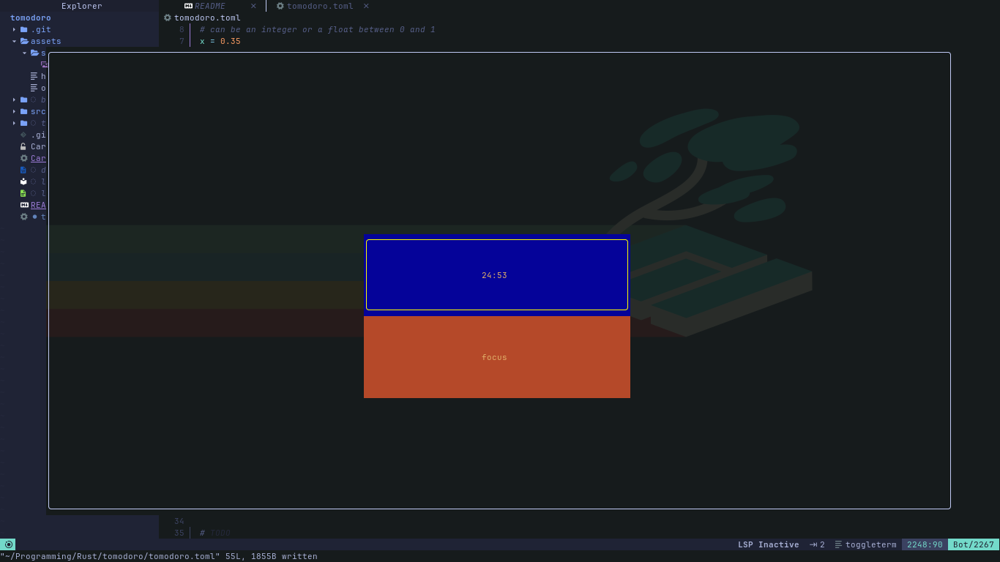

# Tomodoro 🦀
___

Tomodoro is a [pomdoro](https://en.wikipedia.org/wiki/Pomodoro_Technique) that runs on your beloved terminal
> Note: this is under a slow development, if you believe that this project deserves more contribution don't hesitate to make a pull request and I'll be more than happy reviewing it


## Screenshots




## Environment Variables

To run this project, you will need to have the following environment variable configured under your system

`TOMODORO_PATH`: Path to the configuration file
## Try it out!

> NOTE: I'm still working on packaging it, so for now you can consider running the project under the development environment

— Assuming that you have `rustc` and `cargo` installed.

If your are under `NixOs` or have the `nix` package manager installed, you can simply:
* Clone the project:
```bash
git clone https://github.com/yassinebenarbia/Tomodoro.git
```
* start a shell session 
```nix
nix develop
```
* Run the project
```bash
cargo run
```
or else you can:

* Clone the project:
```bash
git clone https://github.com/yassinebenarbia/Tomodoro.git
```
* Install dependencies:
```bash
cd tomodoro && cargo install
```
* Export the config path:
```bash
export TOMODORO_PATH=$(pwd)
```
* Run the project
```bash
cargo run
```
##  Custom Options
Under the `tomodoro.toml` you can invoke custom options 

### Timer

|Option          |Description                                                                                                                                  |Type                                             |
|----------------|---------------------------------------------------------------------------------------------------------------------------------------------|-------------------------------------------------|
|color           |color of the `Timer` widget                                                                                                                  |**String**                                       |
|background_color|background color ofthe `Timer` widget                                                                                                        |**String**                                       |
|width           |width of the `Timer` widget, this can take a fixed number of characters or a float represent the ratio with respect to the terminal size     |positive **Integer** or **Float** between 0 and 1|
|height          |height of the `Timer`, this can take a fixed number of characters or a float represent the ratio with respect to the terminal size           |positive **Integer** or **Float** between 0 and 1|
|x               |x position of the `Timer` widget, this can take a fixed number of characters or a float represent the ratio with respect to the terminal size|positive **Integer** or **Float** between 0 and 1|
|y               |y position of the `Timer` widget, this can take a fixed number of characters or a float represent the ratio with respect to the terminal size|positive **Integer** or **Float** between 0 and 1|
|focus_duration  |how lowg the _focus_ phase should take in seconds                                                                                            |positive **Integer**                             |
|rest_duration   |how lowg the _rest_ phase should take in seconds                                                                                             |positive **Integer**                             |
|max_cycles      |the maximum amount of cycles                                                                                                                 |positive **Integer**                             |
|cycles          |the number of cycles the application should start from                                                                                       |positive **Integer**                             |
|focus_alarm     |path to an audio that will play on the start of the _focus_ phase, this path should under the `$TOMODORO_PATH` path                          |**String**                                       |
|rest_alarm      |path to an audio that will play on the start of the _rest_ phase, this path should under the `$TOMODORO_PATH` path                           |**String**                                       |

# Button

|Option          |Description                                                                                                                                   |Type                                             |
|----------------|----------------------------------------------------------------------------------------------------------------------------------------------|-------------------------------------------------|
|color           |color of the `Button` widget                                                                                                                  |**String**                                       |
|background_color|background color ofthe `Button` widget                                                                                                        |**String**                                       |
|width           |width of the `Button` widget, this can take a fixed number of characters or a float represent the ratio with respect to the terminal size     |positive **Integer** or **Float** between 0 and 1|
|height          |height of the `Button`, this can take a fixed number of characters or a float represent the ratio with respect to the terminal size           |positive **Integer** or **Float** between 0 and 1|
|x               |x position of the `Button` widget, this can take a fixed number of characters or a float represent the ratio with respect to the terminal size|positive **Integer** or **Float** between 0 and 1|
|y               |y position of the `Button` widget, this can take a fixed number of characters or a float represent the ratio with respect to the terminal size|positive **Integer** or **Float** between 0 and 1|
|focus_banner    |banner that will be displayed on the focus phase, defaults to "focus"                                                                         |**String**                                       |
|rest_banner     |banner that will be displayed on the rest phase, defaults to "rest"                                                                           |**String**                                       |
|pause_banner    |banner that will be displayed on pausing, defaults to "pause"                                                                                 |**String**                                       |
